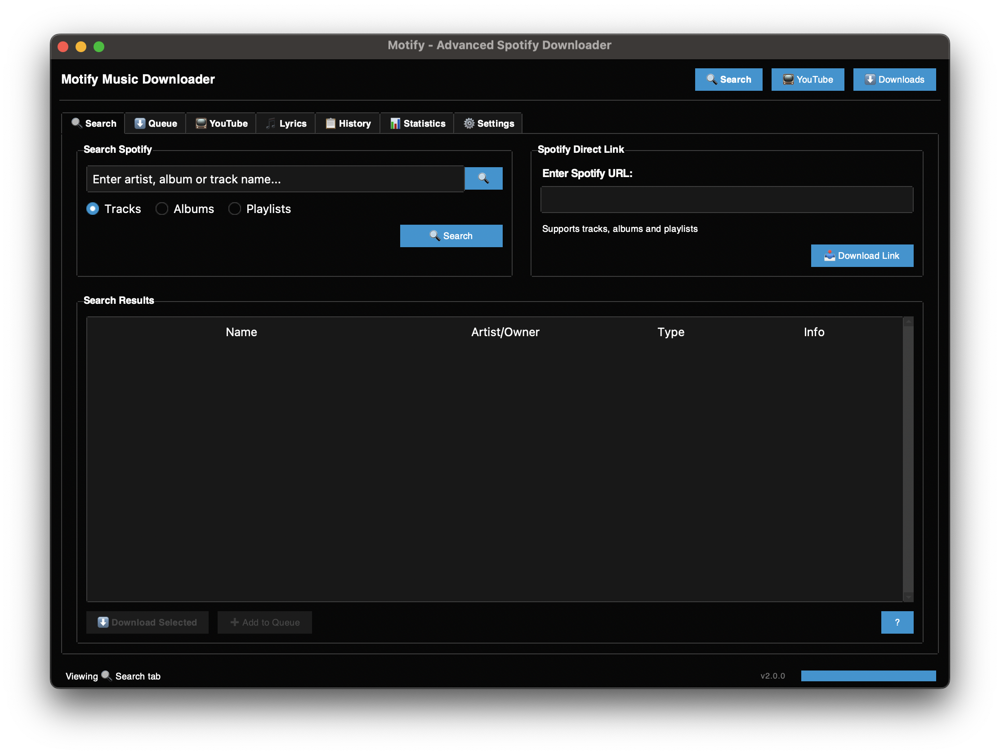
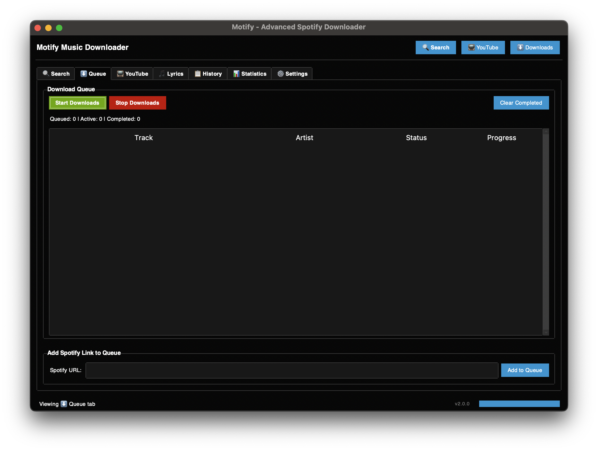
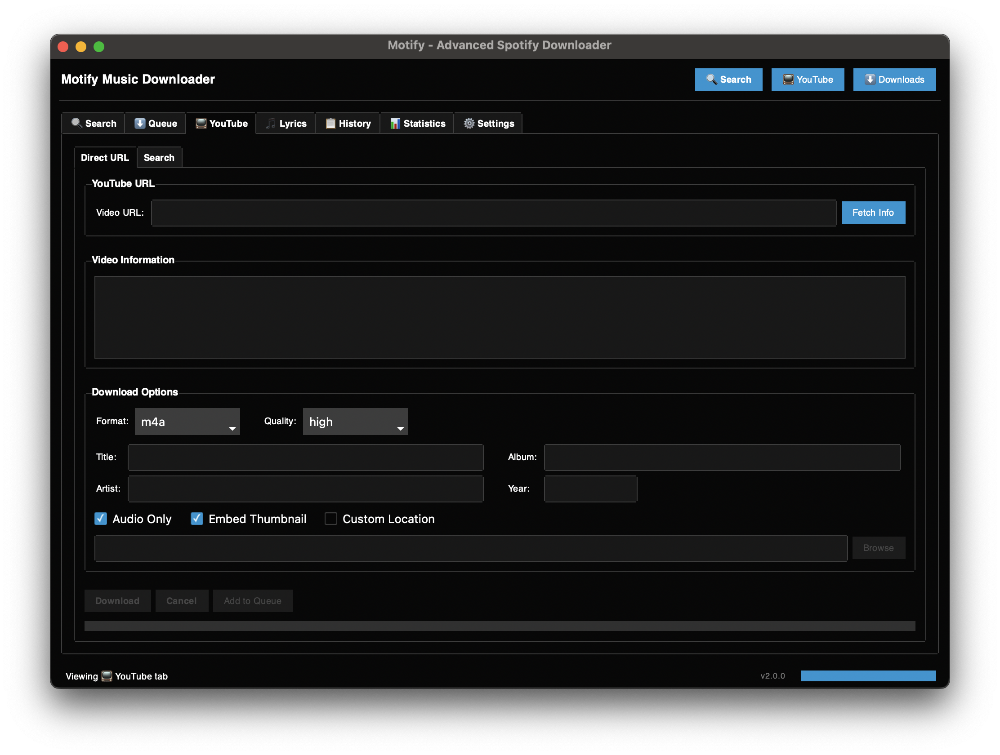
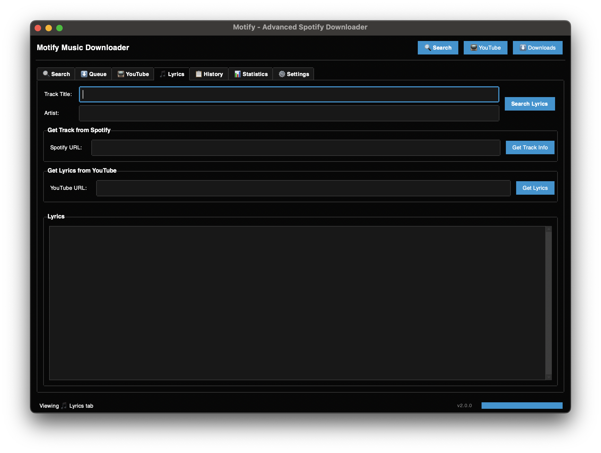
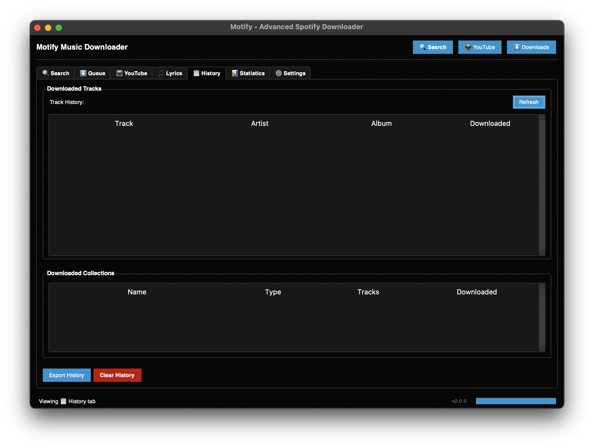
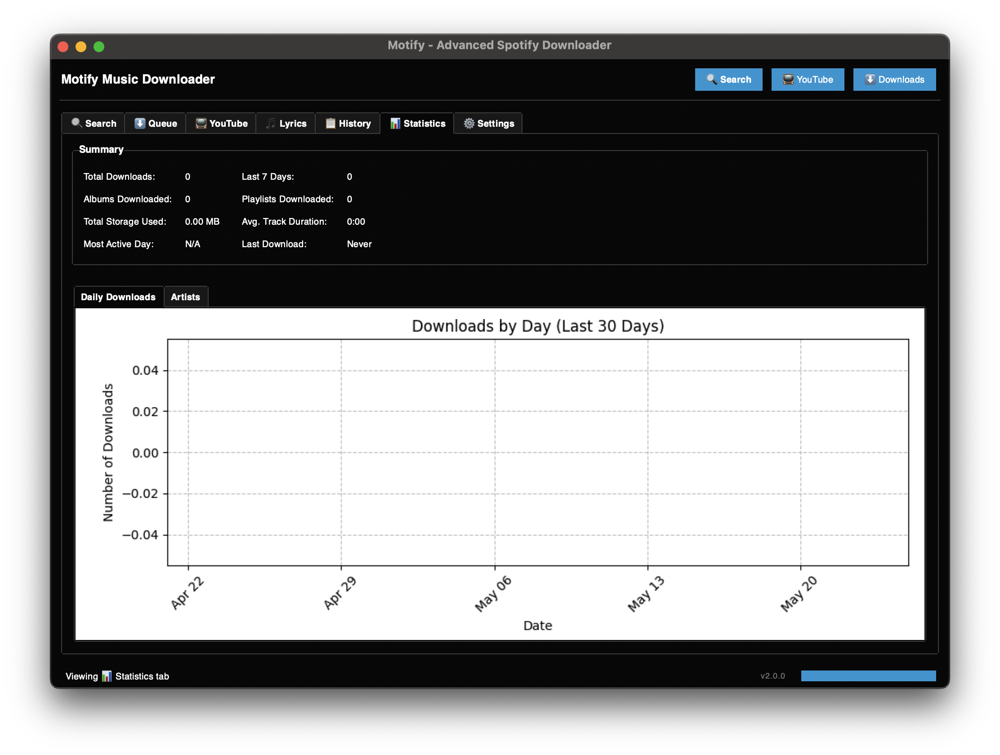
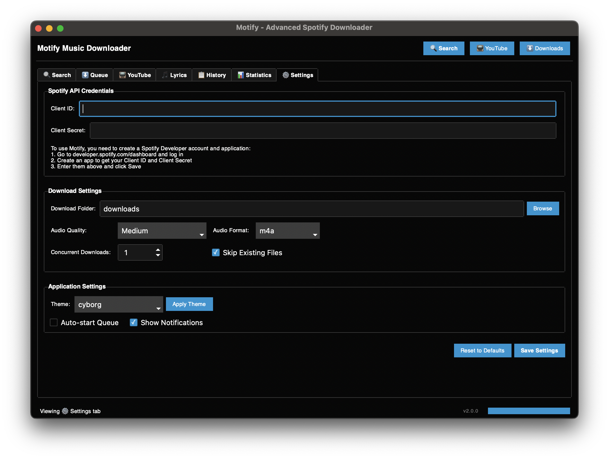

# Welcome to Motify Docs

Motify is a modern, open-source Spotify music downloader and manager with a beautiful GUI, advanced playlist features, and high-quality audio support.

## 🚀 Key Features

### 🎵 High Quality Audio
Download music from Spotify with premium audio quality and metadata

### 🎨 Modern Interface
Intuitive and beautiful graphical user interface with dark mode support

### 📱 Playlist Management
Organize and manage your playlists with an efficient queue system

### 📊 Download History
Track your downloads with detailed statistics and history

## 🎯 Quick Start

<div class="grid quick-start" markdown>

### 1. Install
```bash
pip install motify-music
```

### 2. Configure
```bash
motify --setup
```

### 3. Download
```bash
motify --download "playlist_url"
```

</div>

## 🖼️ Screenshots


*Clean and intuitive main interface*


*Advanced playlist management*


*Efficient download queue system*


*Built-in lyrics support*


*Detailed download history*


*Customizable settings*


*Usage statistics and insights*

## 🌟 Why Choose Motify?

<div class="grid features" markdown>

### 🚀 Fast & Efficient
- Quick downloads with parallel processing
- Smart queue management
- Optimized resource usage

### 🎨 Beautiful Interface
- Modern, clean design
- Dark/Light themes
- Responsive layout
- Smooth animations

### 🔒 Secure & Private
- Local processing
- No data collection
- Open source code
- Regular updates

### 🛠️ Developer Friendly
- Well-documented API
- Plugin system
- Custom themes
- Extensible architecture

</div>

## 📚 Quick Links

- [📥 Installation Guide](installation.md)
  Get started with Motify in minutes

- [📖 User Guide](usage.md)
  Learn how to use Motify effectively

- [🛠️ API Reference](api.md)
  Integrate Motify into your projects

- [❓ Troubleshooting](troubleshooting.md)
  Find solutions to common issues

## 💡 Getting Started

```bash
# Install Motify
pip install motify-music

# Run Motify
motify
```

[Get Started →](installation.md){ .md-button .md-button--primary }
[View on GitHub](https://github.com/mosh3eb/motify){ .md-button }

## 🤝 Contributing

We welcome contributions! Check out our [Contributing Guide](contributing.md) to get started.

## 📈 Roadmap

<div class="grid roadmap" markdown>

### 🚀 Coming Soon
- Mobile companion app
- Cloud sync support
- Advanced playlist management
- Audio preview improvements

### 🎯 Future Plans
- Plugin system
- More music services
- Custom themes
- Advanced analytics

</div>