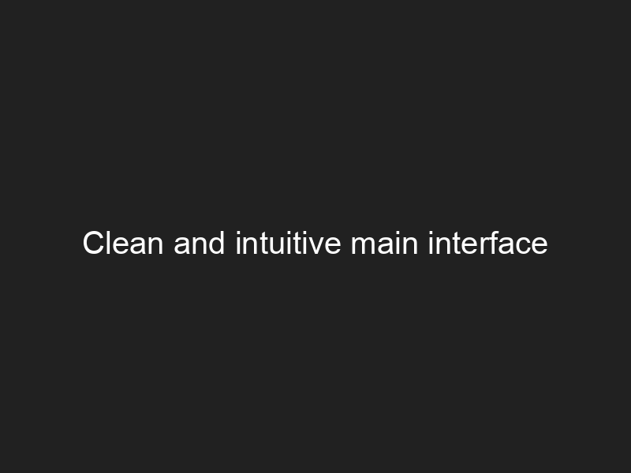
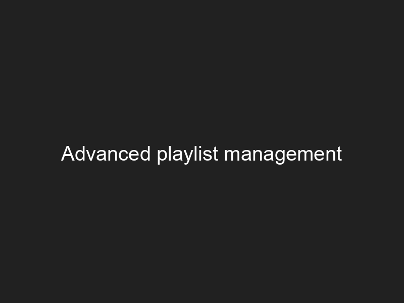
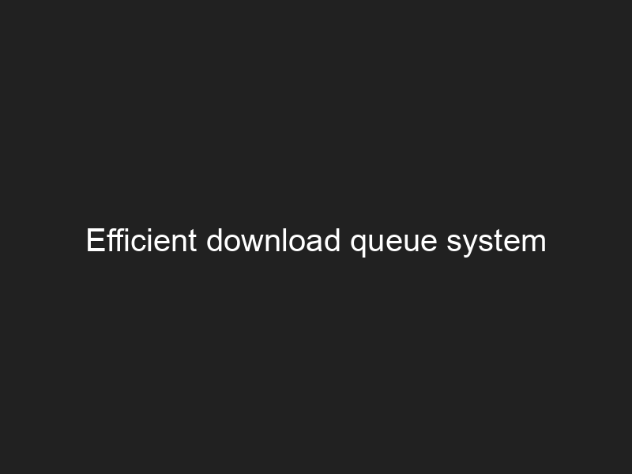
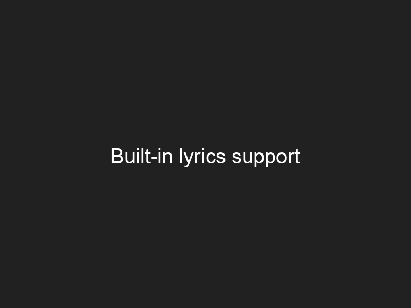
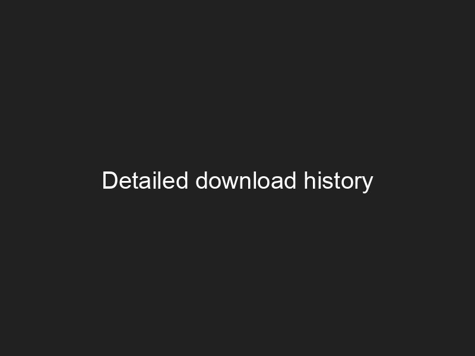
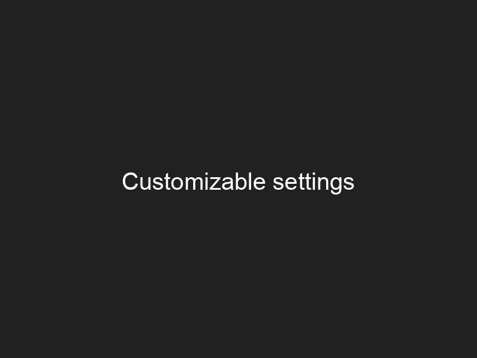
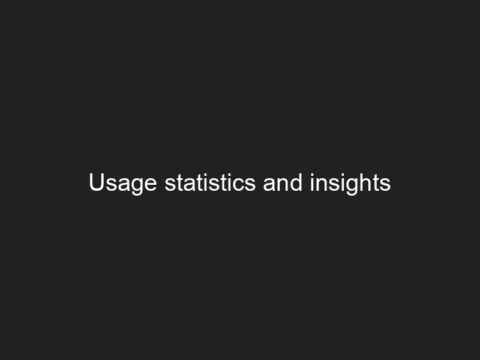

# Welcome to Motify Docs

Motify is a modern, open-source Spotify music downloader and manager with a beautiful GUI, advanced playlist features, and high-quality audio support.

## 🚀 Key Features

<div class="grid feature-cards" markdown>

### 🎵 High Quality Audio
Download music from Spotify with premium audio quality and metadata

### 🎨 Modern Interface
Intuitive and beautiful graphical user interface with dark mode support

### 📱 Playlist Management
Organize and manage your playlists with an efficient queue system

### 📊 Download History
Track your downloads with detailed statistics and history

</div>

## 🖼️ Screenshots

<div class="grid screenshots" markdown>

{: loading=lazy }
*Clean and intuitive main interface*
{: .image-caption }

{: loading=lazy }
*Advanced playlist management*
{: .image-caption }

{: loading=lazy }
*Efficient download queue system*
{: .image-caption }

{: loading=lazy }
*Built-in lyrics support*
{: .image-caption }

{: loading=lazy }
*Detailed download history*
{: .image-caption }

{: loading=lazy }
*Customizable settings*
{: .image-caption }

{: loading=lazy }
*Usage statistics and insights*
{: .image-caption }

</div>

## 📚 Quick Links

<div class="grid quick-links" markdown>

- [📥 Installation Guide](installation.md)
  Get started with Motify in minutes
  {: .link-description }

- [📖 User Guide](usage.md)
  Learn how to use Motify effectively
  {: .link-description }

- [🛠️ API Reference](api.md)
  Integrate Motify into your projects
  {: .link-description }

- [❓ Troubleshooting](troubleshooting.md)
  Find solutions to common issues
  {: .link-description }

</div>

## 💡 Getting Started

```bash
# Install Motify
pip install motify-music

# Run Motify
motify
```

<div class="cta-buttons" markdown>
[Get Started →](installation.md){ .md-button .md-button--primary }
[View on GitHub](https://github.com/mosh3eb/motify){ .md-button }
</div>